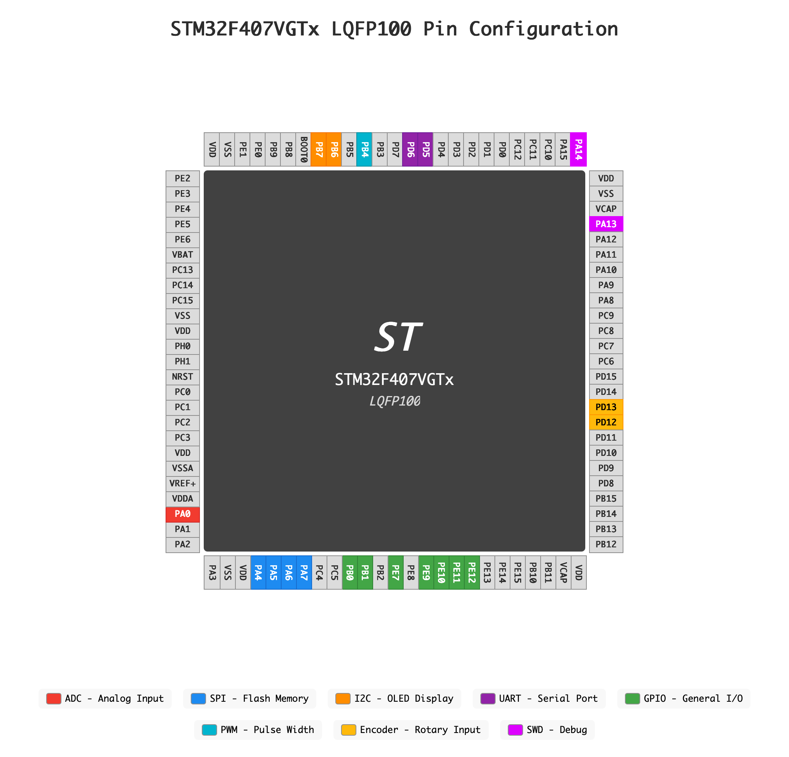

# Motor Monitor - STM32F407VGT6 Embedded System

A bare-metal STM32F407VGT6 motor monitoring system designed for embedded systems learning and experimentation, implemented with pure register-level programming.

## Project Overview

This is a comprehensive motor monitoring solution featuring real-time current sensing, encoder feedback, user interface, and UART communication. The project demonstrates bare-metal embedded programming techniques with direct register manipulation for optimal performance.

## Hardware Platform

- **MCU**: STM32F407VGT6 (ARM Cortex-M4, 168MHz)
- **Motor Control**: Direction control + enable output
- **Sensing**: Hall encoder position feedback + current monitoring
- **Current Detection**: ADC-DMA based real-time sampling
- **User Interface**: 4-button input + OLED display (I2C)
- **Communication**: UART interface for FPGA data exchange
- **Debug Interface**: SEGGER RTT real-time terminal

## Core Features

### 🔧 Pure Register Programming
- No STM32 HAL/LL library dependencies
- Direct register manipulation for optimal performance
- Complete low-level driver implementation

### ⚡ Real-time Performance
- ADC-DMA continuous sampling (~500kHz)
- 1ms SysTick time base system
- Event-driven architecture with fast response

### 📱 Rich User Interface
- Multi-level menu system
- OLED graphics display with font support
- Button + encoder input handling
- Real-time parameter monitoring

### 🛡️ Safety Features
- Current threshold protection
- Emergency stop capability
- State machine safety switching

### Core Modules

#### 1. Board Support Package (BSP)
- **Files**: `Inc/bsp.h`, `Src/bsp.c`
- **Function**: Hardware initialization, pin configuration, system clock setup
- **Features**: Unified hardware abstraction interface

#### 2. Register-based Driver Layer
- **Location**: `Drivers/Register_base/`
- **Modules**: GPIO, ADC, DMA, TIM, UART, I2C, etc.
- **Features**: Direct register operations, no HAL dependencies

#### 3. Event Processing System
- **Files**: `Inc/event.h`, `Src/event.c`
- **Function**: Motor control state machine, button handling, periodic monitoring
- **Architecture**: Main loop polling with interrupt-triggered events

#### 4. OLED UI Library
- **Location**: `Drivers/OLED_UI_Core/`
- **Features**: Multi-level menus, graphics rendering, Chinese font support
- **Interface**: I2C communication, button + encoder input

## Hardware Configuration

### Pin Assignment

### Clock Configuration

- **System Clock**: 168MHz (HSE 8MHz + PLL)
- **APB1**: 42MHz (Timers, UART, I2C)
- **APB2**: 84MHz (ADC, GPIO)
- **SysTick**: 1ms time base

### Critical ADC-DMA Sequence

The ADC-DMA initialization requires a specific sequence:
1. Configure DMA before ADC
2. Enable DMA stream before ADC
3. Set ADC_CR2_DDS bit for continuous DMA requests
4. Start ADC conversion last

## Safety Features

### Current Protection
- Real-time current monitoring
- Configurable threshold alarms
- Automatic power-off protection

### System Monitoring
- Watchdog timer
- System status checks
- Exception handling

### User Safety
- Emergency stop button
- Clear status indicators
- Operation confirmation mechanisms

## Software Timer Architecture

The project implements an excellent software timer system using SysTick that serves as the foundation for all periodic tasks.

### Timer System Design

**Core Components**:
- **SysTick Timer**: 1ms interrupt frequency with minimal ISR overhead
- **Software Timer Structure**: Lightweight timer objects with auto-reload capability
- **Event-driven Architecture**: Main loop polling with timer expiration checks

**Architecture Principles**:
- **Fast ISR**: SysTick handler contains only `system_tick_ms++`
- **Deferred Processing**: Complex logic in main loop handlers
- **Priority Ordering**: Critical tasks execute before UI updates

## OLED UI Library

The project includes an advanced OLED UI library with comprehensive menu-driven interface capabilities:

### Key Features

1. **Multi-level Menu System**: Hierarchical navigation with breadcrumbs
2. **Rich Graphics Engine**: Multiple font sizes, Chinese character support
3. **Input System**: 4-button navigation with encoder support
4. **Display Features**: 128x64 SSD1306/SH1106 OLED support

## Version History

- **v2.0**: Restructured project architecture, added OLED UI library
- **v1.5**: Optimized ADC-DMA performance, stable release
- **v1.0**: Basic motor control and monitoring functionality

## Contributing

This is haoyibits' personal learning project. To contribute:

1. Fork the repository
2. Create a feature branch
3. Submit code changes
4. Create a Pull Request

### Git Configuration

This project is licensed under the MIT License - see the LICENSE file for details.

*A complete development platform designed for embedded systems learning*